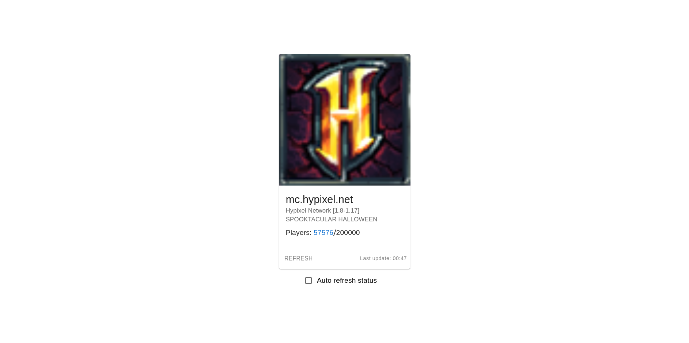

# Minecraft Server Status

Self-hosted website to show Minecraft server status.

Features:

- 🖼️ Server favicon
- 📃 Server description (motd)
- 👥 Connected player list
- 🔄 Auto refresh

## [Demo](https://status.hypixel.super-bunny.fr) 

## Deployment

You can follow the Next.js deployment guide : https://nextjs.org/docs/deployment.

### Environment variables

| Variable name | Description | Required |
| --- | --- | --- |
| MC_SERVER_HOST | HOST of the minecraft server | YES |
| MC_SERVER_PORT | PORT of the minecraft server (default to 25565) | NO |
| NEXT_PUBLIC_MC_SERVER_DISPLAY_NAME | Overwrite title in server status card (server HOST by default) | NO |
| NEXT_PUBLIC_AUTO_REFRESH_DELAY | Overwrite the default refresh time of server status (60000ms) | NO |

### Docker

From project root :

1. Build docker image : `docker build . -t minecraft-server-status-image`
2. Run docker
   image : `docker run -p 3000:3000 --name minecraft-server-status -e "MC_SERVER_HOST=mc.hypixel.net" minecraft-server-status-image`
